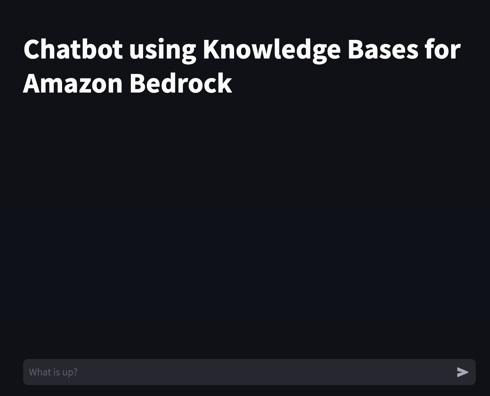

# GenAI Chatbot PoCs

This repository contains sample code demonstrating various use cases leveraging Amazon Generative AI Services. Each sample is a separate project with its own directory, and includes a basic Code to help users quickly set up a proof of concept.

## Sample Proof of Concepts

1. **Amazon-Bedrock-Knowledgebase-Chatbot-POC:**
   This sample demonstrates using Amazon Bedrock Knowledge Base feature to implement Generative AI Chatbot. In the end, you will have a chat interface to interact with Amazon Bedrock Knowledge Base.

     

## Security

See [CONTRIBUTING](CONTRIBUTING.md#security-issue-notifications) for more information.

## License

This library is licensed under the MIT-0 License. See the LICENSE file.

