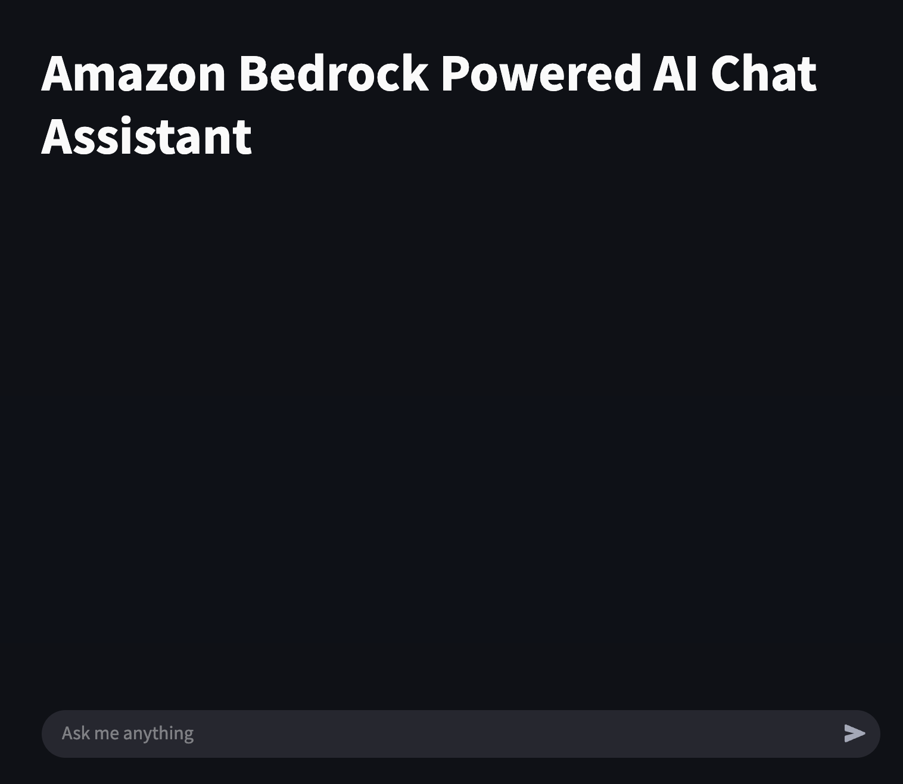
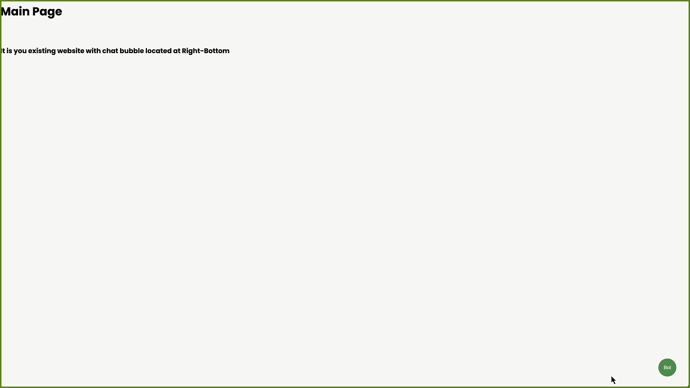

# GenAI Chatbot Samples

This repository contains sample code demonstrating various use cases leveraging Amazon Generative AI Services. Each folder is a separate project with its own directory and includes basic code to help users quickly set up a proof of concept.

1. **[Contextual Chatbot with AWS Hosted Interface](/contextual-chatbot-with-aws-hosted-interface/)**
   
   This sample deploys a generative AI chatbot utilizing the Amazon Bedrock Knowledge Base feature to provide contextual information for a Large Language Model (LLM). To interact with the Large Language Model (LLM), it deploys a Streamlit application hosted on AWS.

     

2. **[Contextual Chatbot with Self Hosted Interface](/contextual-chatbot-with-self-hosted-interface/)**

   This sample deploys a generative AI chatbot that utilizes the Amazon Bedrock Knowledge Base feature to provide contextual information for a Large Language Model (LLM). To interact with the LLM, you can follow the instructions to customize the JavaScript file and add a chat widget to your existing web pages.

     

3. **[Contextual Chatbot Application with Terraform](/contextual-chatbot-application-with-terraform/)**

   This Sample delivers a comprehensive Infrastructure as Code solution using Terraform to deploy a secure Generative AI Chatbot application. The solution features robust user authentication and authorization through Amazon Cognito, coupled with efficient document management capabilities through Amazon S3 storage. At its core, the chatbot leverages Amazon Bedrock Knowledgebase to provide contextual conversations while implementing user-specific content filtering based on authentication status. The system includes document synchronization features and maintains a centralized knowledge repository for accurate responses. Through automated resource provisioning and configuration, organizations can rapidly deploy this production-ready AI chatbot solution that seamlessly integrates user management, knowledge base functionality, and intelligent conversation capabilities in a scalable architecture.

     

## Security

See [CONTRIBUTING](CONTRIBUTING.md#security-issue-notifications) for more information.

## License

This library is licensed under the MIT-0 License. See the LICENSE file.

## Contributors

* [Vamsi Pitta](https://github.com/vamsi619)
* [Chintan Patel](https://github.com/chintanpatel-ai)

