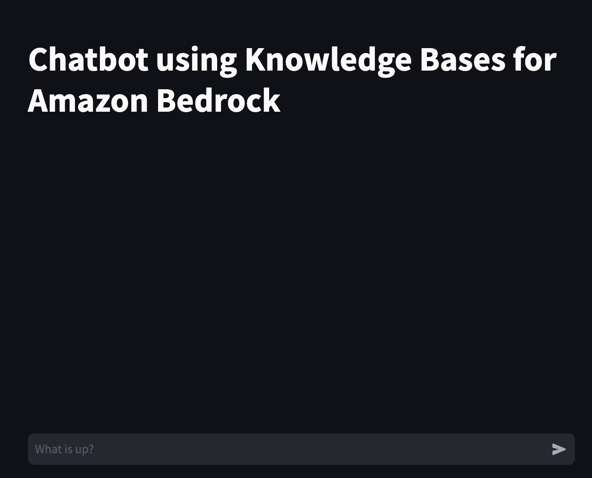

# Chatbot using Amazon Bedrock Knowledge Base

Modern chatbots can serve as digital agents, providing a new avenue for delivering 24/7 customer service and support across many industries. Their popularity stems from the ability to respond to customer inquiries in real time and handle multiple queries simultaneously in different languages. Chatbots also offer valuable data-driven insights into customer behavior while scaling effortlessly as the user base grows; therefore, they present a cost-effective solution for engaging customers. Chatbots use the advanced natural language capabilities of large language models (LLMs) to respond to customer questions. They can understand conversational language and respond naturally. However, chatbots that merely answer basic questions have limited utility. To become trusted advisors, chatbots need to provide thoughtful, tailored responses.

One way to enable more contextual conversations is by linking the chatbot to internal knowledge bases and information systems. Integrating proprietary enterprise data from internal knowledge bases enables chatbots to contextualize their responses to each user's individual needs and interests. For example, a chatbot could suggest products that match a shopper's preferences and past purchases, explain details in language adapted to the user's level of expertise, or provide account support by accessing the customer's specific records. The ability to intelligently incorporate information, understand natural language, and provide customized replies in a conversational flow allows chatbots to deliver real business value across diverse use cases.

The popular architecture pattern of [Retrieval Augmented Generation](https://docs.aws.amazon.com/sagemaker/latest/dg/jumpstart-foundation-models-customize-rag.html) (RAG) is often used to augment user query context and responses. RAG combines the capabilities of LLMs with the grounding in facts and real-world knowledge that comes from retrieving relevant texts and passages from corpus of data. These retrieved texts are then used to inform and ground the output, reducing hallucination and improving relevance.

This sample illustrates contextually enhancing a chatbot by using [Knowledge Bases for Amazon Bedrock](https://aws.amazon.com/bedrock/knowledge-bases/), a fully managed serverless service. The Knowledge Bases for Amazon Bedrock integration allows our chatbot to provide more relevant, personalized responses by linking user queries to related information data points. Internally, [Amazon Bedrock](https://aws.amazon.com/bedrock/) uses embeddings stored in a vector database to augment user query context at runtime and enable a managed RAG architecture solution.

Source: [Build a contextual chatbot application using Knowledge Bases for Amazon Bedrock](https://aws.amazon.com/blogs/machine-learning/build-a-contextual-chatbot-application-using-knowledge-bases-for-amazon-bedrock/)


## Project Overview

This project has 3 parts:

1. Chatbot Knowledge Base
2. Streamlit Serverless application for Chat Interface
3. Use Javascript (JQuery) based Chatbot UI 

To deploy Chatbot Knowledge Base, read [Chatbot Knowledge Base Instruction](/chatbot-knowledgebase/README.md). By the end of it, you will deploy a CloudFormation Stack with all components and a Lambda Function ```InvokeKnowledgeBase```.

### Option 1 : Deploying Stand-alone Application through Streamlit

You can continue to deploy a [Streamlit Serverless application for Chat Interface](/streamlit-serverless/README.md) following the instructions.

***Note: If you continue to deploy Streamlit application, it internally calls the same Lambda Function ```InvokeKnowledgeBase``` to generate responses from Amazon Bedrock Knowledge Base.***

In the end, you will have a chat interface to interact with Amazon Bedrock Knowledge Base.

</br></br>

### Option 2 : Integrate Chatbot UI into existing website through jquery

 You can deploy simple UI to host Generative AI Chatbot in existing website by following instruction as mentioned in [Deploy JQuery based Chatbot UI](./jqueryClient/README.md). 
 
 The final solution would look like as below.  
<br><br>
