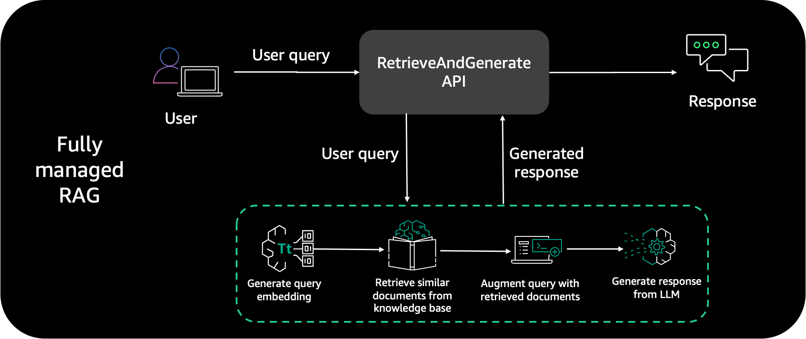
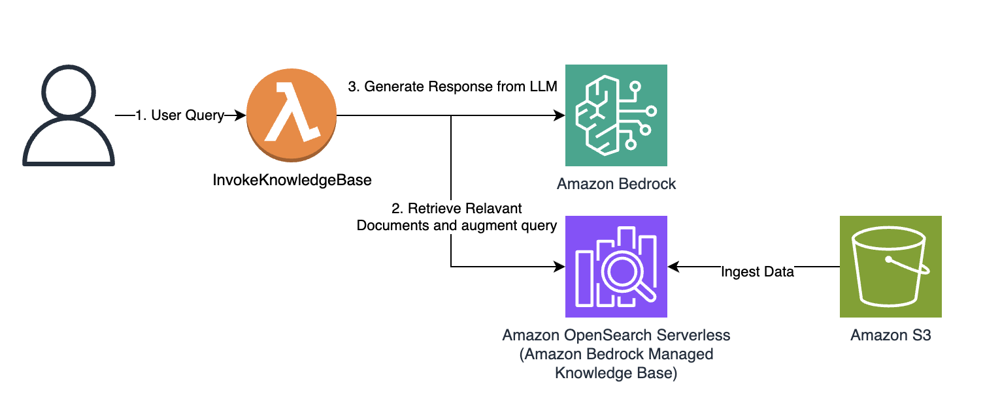
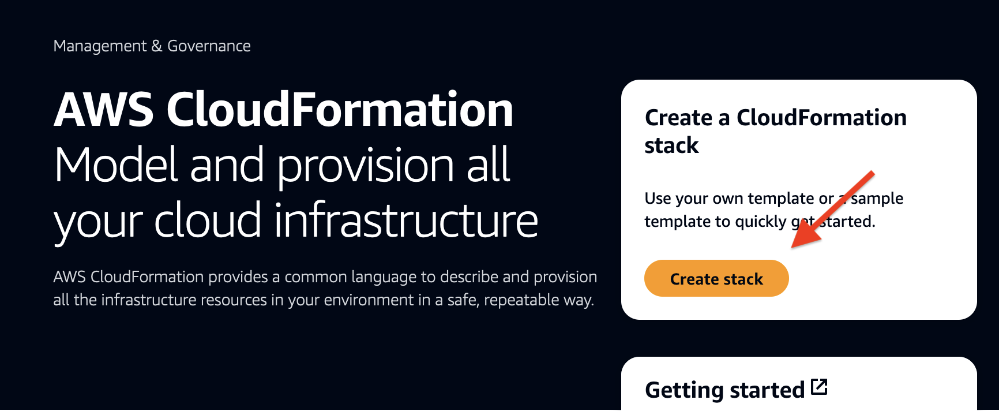
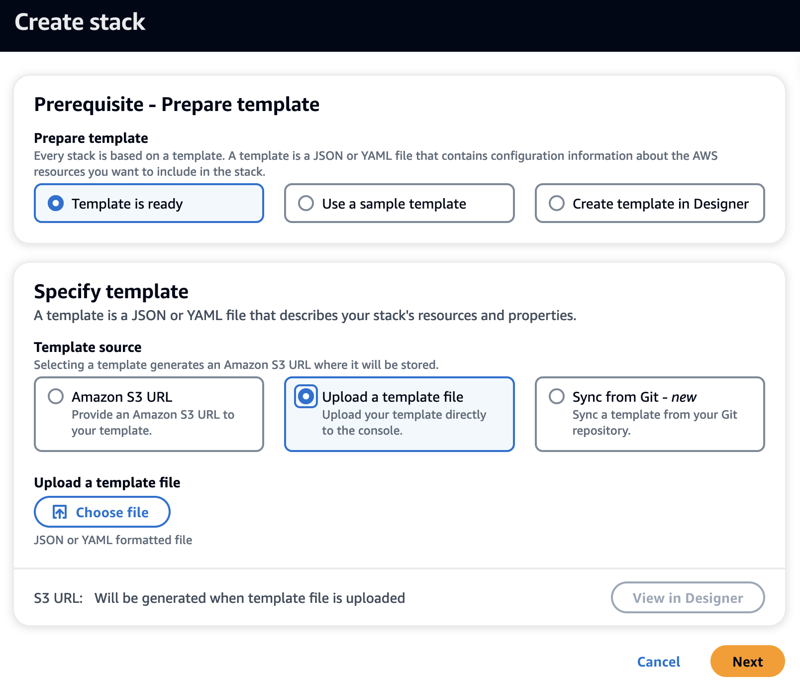
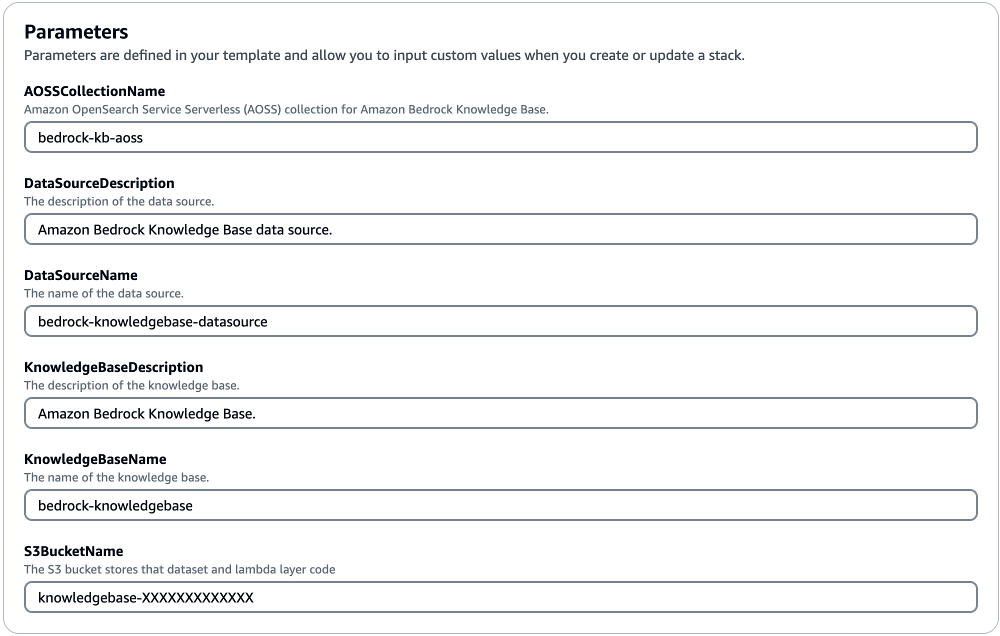
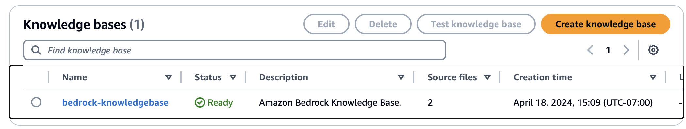
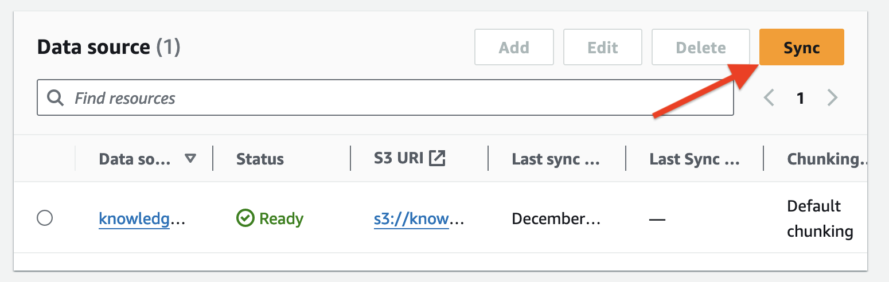
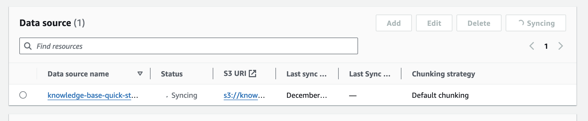
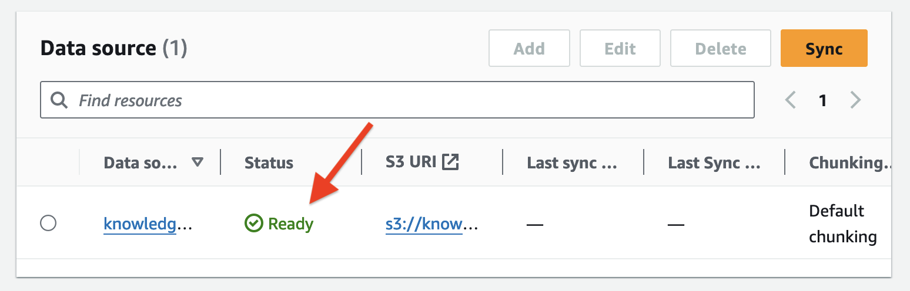
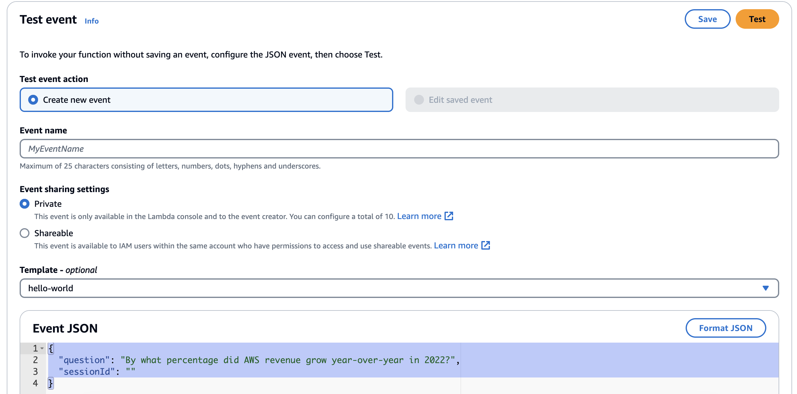

## Knowledge Bases for Amazon Bedrock

[Knowledge Bases for Amazon Bedrock](https://aws.amazon.com/bedrock/knowledge-bases/) is a serverless option to build powerful conversational AI systems using RAG. It offers fully managed data ingestion and text generation workflows. 

For data ingestion, it handles creating, storing, managing, and updating text embeddings of document data in the vector database automatically. It splits the documents into manageable chunks for efficient retrieval. The chunks are then converted to embeddings and written to a vector index, while allowing you to see the source documents when answering a question. 

For text generation, Amazon Bedrock provides the [RetrieveAndGenerate](https://docs.aws.amazon.com/bedrock/latest/APIReference/API_agent-runtime_RetrieveAndGenerate.html) API to create embeddings of user queries, and retrieves relevant chunks from the vector database to generate accurate responses. It also supports source attribution and short-term memory needed for RAG applications. 

This enables you to focus on your core business applications and removes the undifferentiated heavy lifting.

## Solution overview

This solution includes the following AWS services:

* [Amazon Simple Storage Service)](https://aws.amazon.com/s3/) (Amazon S3) as source
* [Knowledge Bases for Amazon Bedrock](https://aws.amazon.com/bedrock/knowledge-bases/)
* [Amazon OpenSearch Serverless](https://aws.amazon.com/opensearch-service/features/serverless/) vector store to save text embeddings
* [AWS Lambda](https://aws.amazon.com/lambda/) as API function to invoke Knowledge Bases API

</br></br>

</br></br>

This architecture includes the following steps:
* A user submits a query in natural language using ```Test Event``` in ```InvokeKnowledgeBase``` Lambda Function.
* This triggers the Lambda function, which invokes the Knowledge Bases ```RetrieveAndGenerate``` API. Internally, Knowledge Bases uses an [Amazon Titan](https://aws.amazon.com/bedrock/titan/) embedding model and converts the user query to a vector and finds chunks that are semantically similar to the user query. The user prompt is than augmented with the chunks that are retrieved from the knowledge base. The prompt alongside the additional context is then sent to a LLM for response generation. In this solution, we use [Anthropic Claude Instant](https://aws.amazon.com/bedrock/claude/) as our LLM to generate user responses using additional context. Note that this solution is supported in Regions where Anthropic Claude on Amazon Bedrock is [available](https://docs.aws.amazon.com/bedrock/latest/userguide/what-is-bedrock.html#bedrock-regions).
* A contextually relevant response is sent back as response.

## Prerequisites
Amazon Bedrock users need to request access to foundation models before they are available for use. This is a one-time action and takes less than a minute. For this solution, you’ll need to enable access to the Titan Embeddings G1 - Text and Claude Instant - v1.2 model in Amazon Bedrock. For more information, refer to [Model access](https://docs.aws.amazon.com/bedrock/latest/userguide/model-access.html). 

## Clone the GitHub repo

To clone this GitHub repository run the following commands.

```git clone <CLONE_URL>```

```cd amazon-bedrock-knowledgebase-chatbot-poc/chatbot-knowledgebase/```

### Upload your knowledge dataset to Amazon S3
Prepare the dataset for knowledge base and upload it into a S3 bucket. This dataset will feed and power knowledge base. Complete the following steps:

1. On the Amazon S3 console, choose **Buckets** in the navigation pane.
2. Click **Create bucket**.
3. Name the bucket ```knowledgebase-<*your-account-number*>```.
4. Leave all other bucket settings as default and choose **Create**. 
5. Navigate to the ```knowledgebase-<*your-account-number*>``` bucket. 
6. Choose Create folder and name it ```dataset```.
7. Leave all other folder settings as default and choose **Create**.
8. Navigate to the ```dataset``` folder
9. Drag and drop the source files you prepared earlier to this bucket and choose **Upload**.

### Create AWS CloudFormation Stack
All Resources are deployed using an [AWS CloudFormation](http://aws.amazon.com/cloudformation) template ```DeployKnowledgeBase.yaml``` available under the ```/template``` folder.

1. On the AWS CloudFormation service home page, choose Create stack to create a new stack.
   
</br></br>

2.	Select **Template is ready** for **Prepare template**. 
3.	Select **Upload the template** file for **Template source**. 
4.	Choose **Choose file**, navigate to the code base you cloned earlier, and choose the ```DeployKnowledgeBase.yaml``` file under the ```/template``` folder. 
5.	Choose **Next**.

</br></br>

6.	For **Stack name**, enter a name.
7.	In the **Parameters** section, S3 bucket name you noted down earlier. 
8.	Choose **Next**.

</br></br>

9.	Leave all default options as is, choose **Next**, and choose **Submit**.
10.	Verify that the CloudFormation template ran successfully, and there are no errors.

***Congratulations, you have created CloudFormation Stack for Chatbot Knowledgebase.***

11.  On Amazon Bedrock console and choose **Knowledge Bases** in the navigation pane.

</br></br>

12.   Now that knowledge base is ready, we need to sync our data to it. In the Data Source section of the knowledge base details page, choose Sync to trigger the data ingestion process from the S3 bucket to the knowledge base.

</br></br>

13.   This sync process splits the document files into smaller chunks of the chunk size specified earlier, generates vector embeddings using the selected text embedding model, and stores them in the vector store managed by Knowledge Bases for Amazon Bedrock.

</br></br>

14.   When the dataset sync is complete, the status of the data source will change to the Ready state. Note that, if you add any additional documents in the S3 data folder, you need to re-sync the knowledge base.

</br></br>

***Congratulations, your Knowledge base is ready.***

### Testing Lambda Function

On Lambda Console, choose ***InvokeKnowledgeBase*** Lambda Function and create a Test event and paste the Event JSON below.

</br></br>

```json
{
  "question": "By what percentage did AWS revenue grow year-over-year in 2022?",
  "sessionId": ""
}
```

You will get a contextual response as below based on your Knowledge Base and the question you've asked.

```json
{
  "statusCode": 200,
  "body": {
    "question": "By what percentage did AWS revenue grow year-over-year in 2022?",
    "answer": "AWS revenue grew 29% year-over-year in 2022 on a $62B revenue base.",
    "sessionId": "646b450c-c993-49c5-9c0a-632d06203837"
  }
}
```

### Clean Up

Failing to delete resources such as the S3 bucket, OpenSearch Serverless collection, and knowledge base will incur charges. To clean up these resources, delete the CloudFormation stack and delete the S3 bucket (including any document folders and files stored in that bucket).
