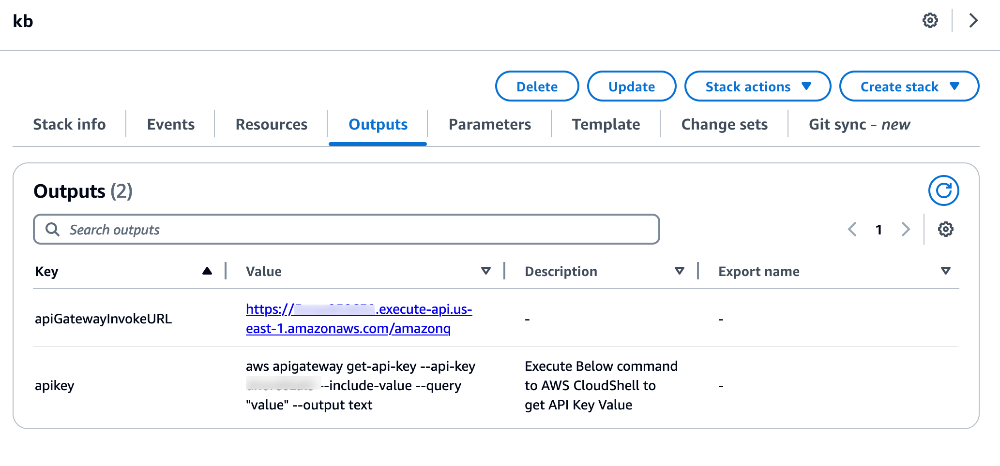
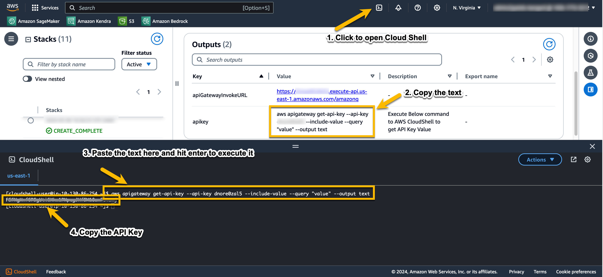
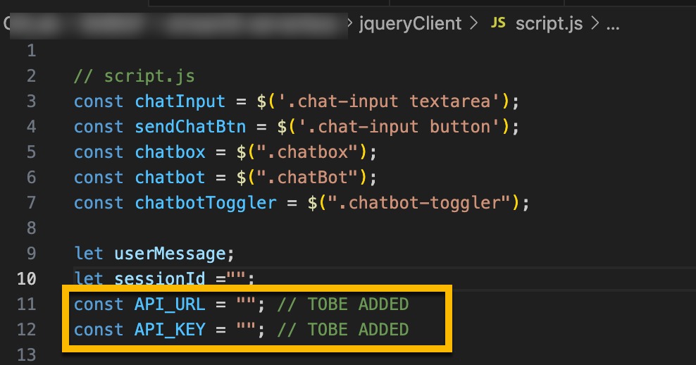
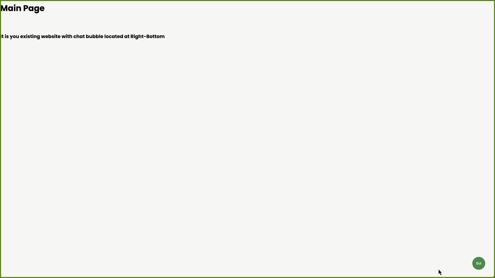

# Integrate Chatbot UI into existing website through jQuery

This guide will walk you through the process of deploying a Generative AI Chatbot into your existing web application using HTML, CSS, and jQuery.

## Prerequisites

Please make sure that you have deployed the Amazon Knowledgebase Solution using the steps mentioned in [Deploy Knowledgebase Solution](../chatbot-knowledgebase/README.md).

## Steps to Integrate with a web Application

* Open the CloudFormation Stack which was deployed as part of the prerequisite.

* Go to the **Outputs** Section of the CloudFormation Stack.
   

* Copy the text from the apiKey Value and execute it by opening the Cloud Shell as shown below.
    

* Paste it in API_KEY at [script.js](./script.js) as shown below.
    

* Similarly, copy the value for **apiGatewayInvokeURL** and paste it in APP_URL at [script.js](./script.js) as shown below.

* Open **index.html** in your preferred browser.
  
