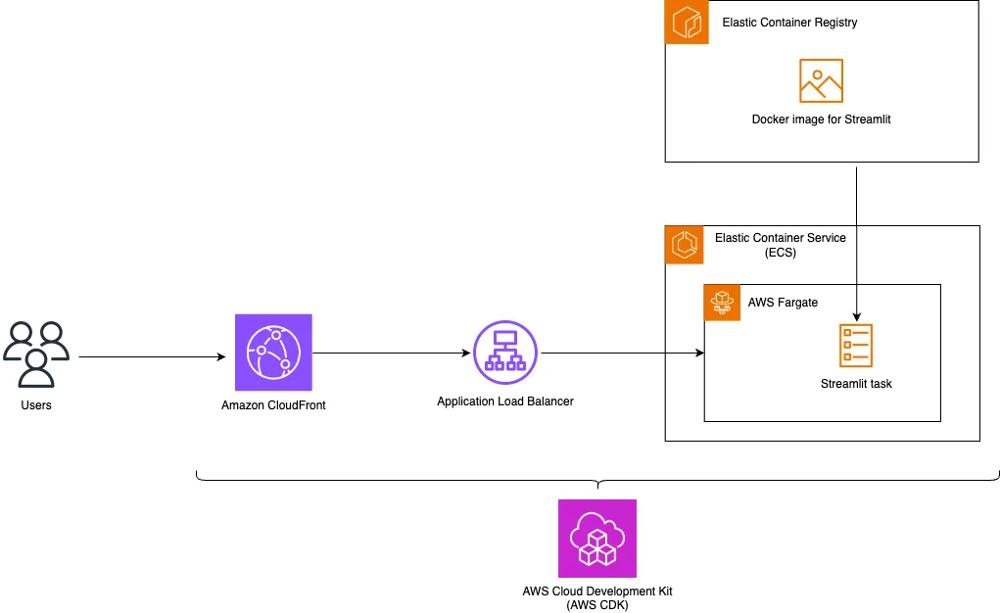

# Run Streamlit Apps as serverless on AWS with HTTPS

This guide will walk you through the process of deploying a Streamlit web application on Amazon Web Services (AWS) using the AWS Cloud Development Kit (CDK) and protect the applicatoin URL with HTTPS. Streamlit is a popular Python library for creating web applications with minimal code, and CDK is an infrastructure as code (IaC) tool that simplifies the process of provisioning and managing AWS resources.

</br></br>

## Prerequisites

Before you begin, make sure you have the following prerequisites:

- **AWS Account**: You need an AWS account with the necessary permissions to create and manage resources.

- **AWS CLI**: Install the AWS Command Line Interface and configure it with your AWS credentials.

- **Python and Pip**: Ensure you have Python and Pip installed on your local machine.

- **CDK**: Install CDK https://docs.aws.amazon.com/cdk/v2/guide/getting_started.html 

- **Docker**: Install Docker https://docs.docker.com/engine/install/


### Clone the GitHub repo

To clone this GitHub repository run the following commands.

```git clone <CLONE_URL>```

```cd amazon-bedrock-knowledgebase-chatbot-poc/streamlit-serverless/```

## Deploy the sample application

### Step 1: Create and activate a Virtualenv

In the ```streamlit-serverless/``` folder, run
```
python3 -m venv .venv
source .venv/bin/activate
```

### Step 2: Install dependencies

```
pip install -r requirements.txt
```

### Step 3: CDK synthesize a templare from your app

Make sure **docker** is running on your local machine. We will use it to build and bundle the Steamlit app docker image locally.
```
export AWS_DEFAULT_REGION=<region>
```

To synthesize a CDK app, use the cdk synth command. Let’s check out the template synthesized from the sample app.

```
cdk synth
```

### Step 4: CDK bootstrapping
Bootstrapping is the process of provisioning resources for the AWS CDK before you can deploy AWS CDK apps into an AWS environment. (An AWS environment is a combination of an AWS account and Region).

```
cdk bootstrap
```

### Step 5: CDK deploy
Use cdk deploy to deploy a CDK app:
```
cdk deploy
```

Upon successful deployment, you will see the application's URL in the outputs:

```
Outputs:
...
StreamlitServerlessApp-FrontendStack.StreamlitURL = https://<prefix>.cloudfront.net
```

## Clean up

Use cdk destroy to delete all resources:
```
cdk destroy
```

Source: https://github.com/kawsark/streamlit-serverless