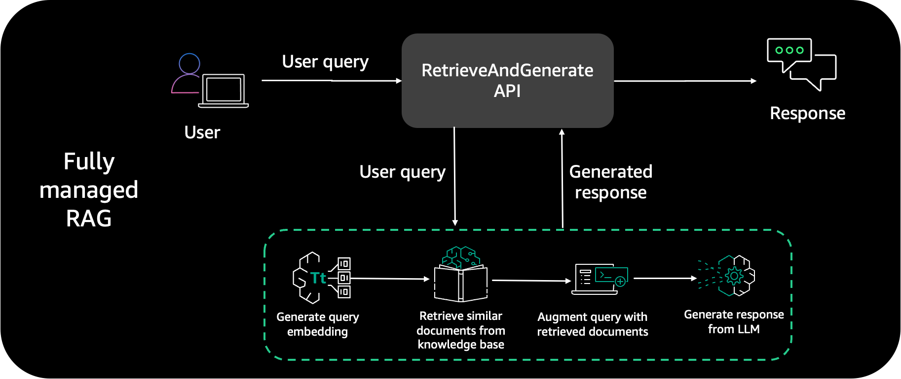
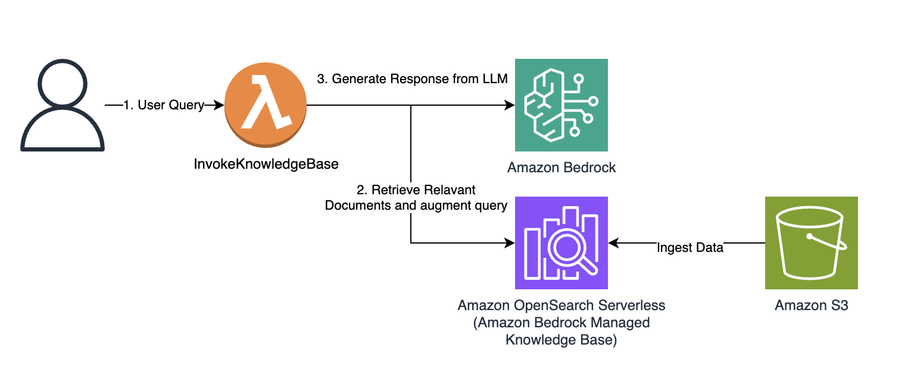
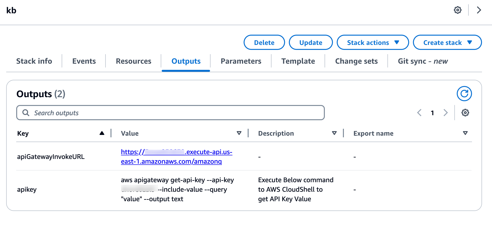
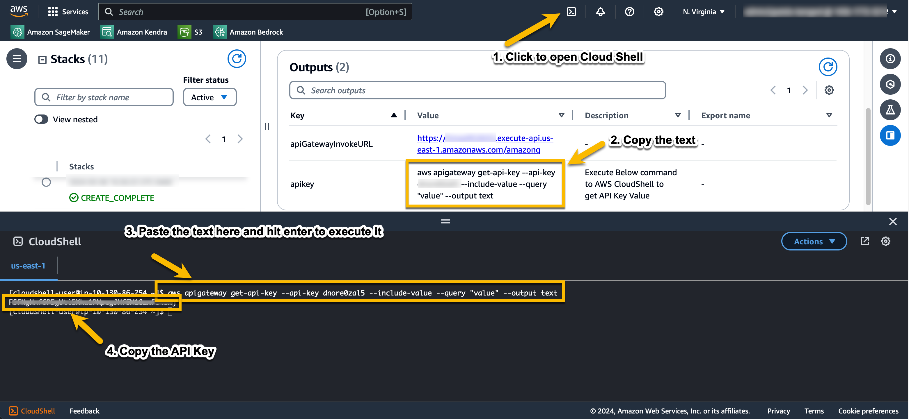

## Table of Contents

1. [Project Overview](#project-overview)
   - [Knowledge Bases for Amazon Bedrock](#knowledge-bases-for-amazon-bedrock)

2. [Solution Overview](#solution-overview)

3. [Part 1 - Deploying an Amazon Bedrock Knowledge Base](#part-1---deploying-an-amazon-bedrock-knowledge-base)
   - [Prerequisites](#prerequisites)
   - [Upload your datasource to Amazon S3 Bucket](#upload-your-datasource-to-amazon-s3-bucket)
   - [Create an Amazon S3 Bucket and Upload Source Code](#create-an-amazon-s3-bucket-and-upload-source-code)
   - [Deploy AWS CloudFormation Stack](#deploy-aws-cloudformation-stack)
   - [Sync Knowledge Base](#sync-knowledge-base)

4. [Part 2 - Add a chat widget to your web pages](#part-2---add-a-chat-widget-to-your-web-pages)

5. [Cleanup](#cleanup)

## Project Overview

Modern chatbots have revolutionized customer service by providing 24/7 support using advanced natural language capabilities through Large Language Models (LLMs). While basic question-answering chatbots have limitations, integration with internal knowledge bases and information systems enables more contextual and personalized conversations. The implementation of [Retrieval Augmented Generation](https://docs.aws.amazon.com/sagemaker/latest/dg/jumpstart-foundation-models-customize-rag.html) (RAG) architecture, particularly through services like [Knowledge Bases for Amazon Bedrock](https://aws.amazon.com/bedrock/knowledge-bases/), allows chatbots to provide more accurate and relevant responses by grounding them in factual information from existing data sources.

### Knowledge Bases for Amazon Bedrock

[Knowledge Bases for Amazon Bedrock](https://aws.amazon.com/bedrock/knowledge-bases/) is a serverless option to build powerful conversational AI systems using RAG. It offers fully managed data ingestion and text generation workflows. 

For data ingestion, it handles creating, storing, managing, and updating text embeddings of document data in the vector database automatically. It splits the documents into manageable chunks for efficient retrieval. The chunks are then converted to embeddings and written to a vector index, while allowing you to see the source documents when answering a question. 

For text generation, Amazon Bedrock provides the [RetrieveAndGenerate](https://docs.aws.amazon.com/bedrock/latest/APIReference/API_agent-runtime_RetrieveAndGenerate.html) API to create embeddings of user queries, and retrieves relevant chunks from the vector database to generate accurate responses. It also supports source attribution and short-term memory needed for RAG applications.

</br></br>

## Solution overview

This solution includes the following AWS services:

* [Amazon Simple Storage Service)](https://aws.amazon.com/s3/) (Amazon S3) as a private data source
* [Knowledge Bases for Amazon Bedrock](https://aws.amazon.com/bedrock/knowledge-bases/) to give foundation models and agents contextual information from your company’s private data sources to deliver more relevant, accurate, and customized responses
* [Amazon OpenSearch Serverless](https://aws.amazon.com/opensearch-service/features/serverless/) vector store to save text embeddings
* [AWS Lambda](https://aws.amazon.com/lambda/) as API function to invoke Knowledge Bases API

</br></br>

This project is separated into two parts for ease of deployment.

1. CloudFormation Template for Deploying an Amazon Bedrock Knowledge Base
2. Instructions to customize and add a chat widget to your web pages

## Part 1 - Deploying an Amazon Bedrock Knowledge Base

#### Prerequisites

* Follow the Instructions to [Add or remove access to Amazon Bedrock foundation models](https://docs.aws.amazon.com/bedrock/latest/userguide/model-access-modify.html) listed below:
    * Titan Text Embeddings V2
    * Amazon Nova Lite

#### Upload your datasource to Amazon S3 Bucket

1. Open [Amazon S3](https://console.aws.amazon.com/s3/), choose **Buckets** in the navigation pane.
2. Click **Create bucket**.
3. Name the bucket ```knowledgebase-<*your-account-number*>```.
4. Leave all other bucket settings as default and choose **Create**. 
5. Navigate to the ```knowledgebase-<*your-account-number*>``` bucket. 
6. Choose Create folder and name it ```datasource```.
7. Leave all other folder settings as default and choose **Create**.
8. Navigate to the ```datasource``` folder
9. Drag and drop the source files you prepared earlier to this bucket and choose **Upload**.

#### Create an Amazon S3 Bucket and Upload Source Code

1. Open [AWS CloudShell](https://console.aws.amazon.com/cloudshell/).
2. Clone the Git Repository and zip the source code

    ```bash
    git clone https://github.com/aws-samples/genai-chatbot-pocs.git
    cd genai-chatbot-pocs/contextual-chatbot-with-self-hosted-interface
    zip -r ../contextual-chatbot-with-self-hosted-interface.zip ./* && cd ..
    ```
3. Create an Amazon S3 bucket and upload source code as a zip file

    ```bash
    export AWS_ACCOUNT_ID=$(aws sts get-caller-identity --query 'Account' --output text)
    if [ "$AWS_REGION" = "us-east-1" ]; then
        aws s3api create-bucket \
            --bucket "codebuild-s3-source-$AWS_ACCOUNT_ID" \
            --region "$AWS_REGION"
    else
        aws s3api create-bucket \
            --bucket "codebuild-s3-source-$AWS_ACCOUNT_ID" \
            --region "$AWS_REGION" \
            --create-bucket-configuration "LocationConstraint=$AWS_REGION"
    fi
    aws s3 cp contextual-chatbot-with-self-hosted-interface.zip s3://codebuild-s3-source-$AWS_ACCOUNT_ID
4. Upload AWS CloudFormation Template from source code and copy Amazon S3 URL.

    ```bash
    aws s3 cp contextual-chatbot-with-self-hosted-interface/amazon-bedrock-knowledgebase/template/DeployKnowledgeBase.yaml s3://codebuild-s3-source-$AWS_ACCOUNT_ID/contextual-chatbot-with-self-hosted-interface/amazon-bedrock-knowledgebase/template/DeployKnowledgeBase.yaml
    echo "AWS CloudFormation Template S3 URL:"
    aws s3 presign s3://codebuild-s3-source-$AWS_ACCOUNT_ID/contextual-chatbot-with-self-hosted-interface/amazon-bedrock-knowledgebase/template/DeployKnowledgeBase.yaml
    ```

#### Deploy AWS CloudFormation Stack

1. Open [AWS CloudFormation Console](https://console.aws.amazon.com/cloudformation/), click Create stack.
2. Select **Template is ready** for **Prepare template**. 
3. Select **Amazon S3 URL** file for **Template source** and paste the AWS CloudFormation Template URL copied from previous step. Choose **Next**.
4. For **Stack name**, enter a name. In the **Parameters** section, For **S3BucketName**, enter `knowledgebase-<*your-account-number*>`.  Click **Next**.
5.	Leave all default options as is, choose **Next**, and choose **Submit**.
6.	Verify that the CloudFormation template ran successfully, and there are no errors.

#### Sync Knowledge Base

1. Access [Amazon Bedrock Console](https://console.aws.amazon.com/bedrock/)
2. Click on `Knowledge Bases` in the navigation menu
3. Click on the newly created Knowledge Base.
4. Under Data Sources, select `Amazon S3 Source` and click on `Sync`.
4. Wait for the sync to finish.


## Part 2 - Add a chat widget to your web pages

1. Open [AWS CloudFormation Console](https://console.aws.amazon.com/cloudformation/) and go to the **Outputs** tab of the CloudFormation Stack.

    <br><br>

2. Copy the text from the apiKey Value and execute it by opening the Cloud Shell as shown below.

     <br><br>

3. Paste it in API_KEY at [script.js](./chat-widget/script.js) as shown below.

     <br><br>

4. Similarly, copy the value for **apiGatewayInvokeURL** and paste it in APP_URL at [script.js](./chat-widget/script.js) as shown below.

5. Open **index.html** in your preferred browser.

    

## Cleanup

1. Open [Amazon S3](https://console.aws.amazon.com/s3/),  select `knowledgebase-XXXXXX` bucket and click on **Empty** bucket. Repeat the process for `codebuild-s3-source-xxxx` bucket.
2. Delete `knowledgebase-XXXXXX` and `codebuild-s3-source-xxxx` once they are empty.
3.  Open [AWS CloudFormation](https://console.aws.amazon.com/cloudformation/), delete `amazon-bedrock-knowledge-base` stack.
